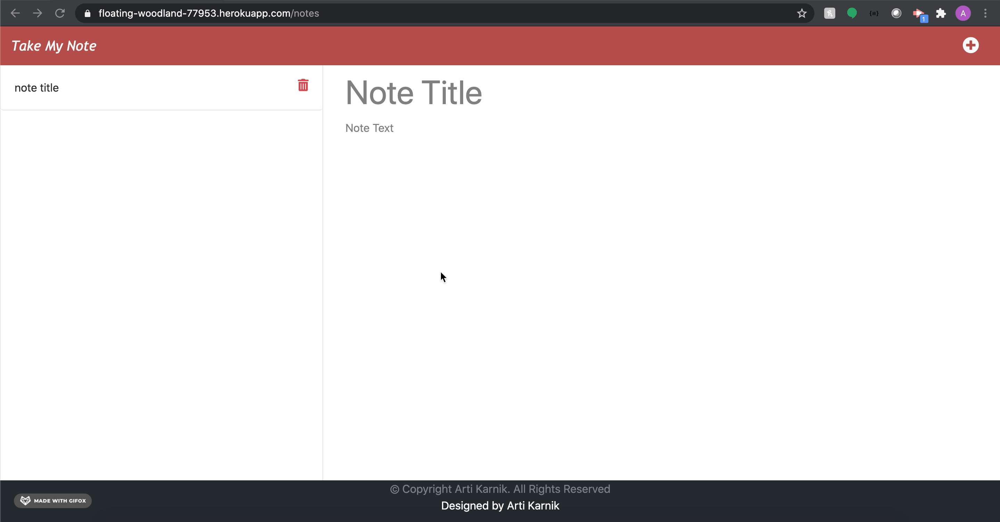

# TakeMyNote
##### Table of Contents  
[Summary:](#summary)  
[Description:](#description) 
[Pre-requisite:](#pre-requisite) 
[Demo:](#demo) 
[Technology used :](#tech) 
[Installation:](#installation)  
[Code snippets:](#code)  
[Testing:](#testing)  
[Contributor:](#contributor)  
[Code-base:](#code)  
[Application Live url:](#liveurl)  

## Summary
this is my header

## Description
this is my header

## Pre-requisite
Install NodeJS 

## Demo

## Technology used
<ul>
    <li> 
    <a href="https://developer.mozilla.org/en-US/docs/Web/JavaScript">Javascript <a>
     
    </li>
    <li> 
    <a href="https://developer.mozilla.org/en-US/docs/Web/JavaScript">NodeJS <a>
    <li> 
    <a href="https://developer.mozilla.org/en-US/docs/Web/JavaScript">Express.js<a>
    </li>
    <li> 
    <a href="https://developer.mozilla.org/en-US/docs/Web/JavaScript">Bootstrap </a>
    </li>
</ul>

## Installation
<strong>Code installation:</strong>  
$ cd [path_to_save_codebase]  
$ git clone https://github.com/arti-karnik/TakeMyNote  

<strong> Run the application: </strong>  
Open Terminal  
$ npm install  
$ node server.js  
Open browser and type => localhost:3010/

## Code to initialize server call:
Initialize Express server and set up routes.

const express = require("express");
const path = require("path");
const PORT = process.env.PORT || 3010;
const app = express();

app.use(express.urlencoded({ extended: true }))
app.use(express.json());
app.use(express.static('public'));
require("./routes/apiRoutes")(app);
require("./routes/htmlRoutes")(app);

 app.listen(PORT, () => {
  console.log(`Listening to the PORT: ${PORT}`)
})

app.get("/api/notes", (req, res) => {
      savedNotes = JSON.parse(fs.readFileSync("./db/db.json", "utf8"));
      console.log("Get notes from db");
      res.json(savedNotes);
  })

## Testing 
Unit tested application in Chrome, Edge and Safari. 
## Contributor
<strong> Github Profile: </strong>  
https://github.com/arti-karnik

<strong> Portfolio: </strong>  
https://arti-karnik.github.io/MyPortfolioPage/

## Code-base
https://github.com/arti-karnik/TakeMyNote

## Application Live url
https://floating-woodland-77953.herokuapp.com/

