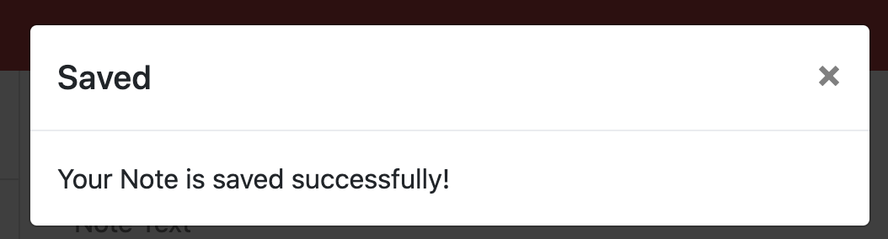

 [TakeMyNote](#takemynote)
    - [Table of Contents](#table-of-contents)
  * [Summary](#summary)
  * [Description](#description)
  * [Pre-requisite](#pre-requisite)
  * [demo](#demo)
  * [Technologyused:](#technologyused-)
  * [Install:](#install-)
  * [Code snippets:](#code-snippets-)
  * [Testing](#testing)
  * [Contributor](#contributor)
  * [codebase](#codebase)
  * [Application Live url](#application-live-url)

## Summary
Application to keep track of tasks/ to-do items. It will allow users to write, edit, delete and save notes. Notes are saved in server and would be retrieve when user open application next time. 

## Description
Create an application called 'Take my Notes' that can be used to write and save notes. This application will use an Express.js back end and will save and retrieve note data from a JSON file. The application’s front end has been created with hTML,CSS, Bootstrap. Application is deployed to Heroku.

## Pre-requisite
Install NodeJS 

## demo

## Technologyused:
<ul>
    <li> 
    <a href="https://developer.mozilla.org/en-US/docs/Web/JavaScript">Javascript <a>
     
    </li>
    <li> 
    <a href="https://developer.mozilla.org/en-US/docs/Web/JavaScript">NodeJS <a>
    <li> 
    <a href="https://developer.mozilla.org/en-US/docs/Web/JavaScript">Express.js<a>
    </li>
    <li> 
    <a href="https://developer.mozilla.org/en-US/docs/Web/JavaScript">Bootstrap </a>
    </li>
</ul>

## Install:
<strong>Code installation:</strong>  
$ cd [path_to_save_codebase]  
$ git clone https://github.com/arti-karnik/TakeMyNote  

<strong> Run the application: </strong>  
Open Terminal  
$ npm install  
$ node server.js  
Open browser and type => localhost:3010/

## Code snippets:
Initialize Express server and set up routes.

const express = require("express");
const path = require("path");
const PORT = process.env.PORT || 3010;
const app = express();

app.use(express.urlencoded({ extended: true }))
app.use(express.json());
app.use(express.static('public'));
require("./routes/apiRoutes")(app);
require("./routes/htmlRoutes")(app);

 app.listen(PORT, () => {
  console.log(`Listening to the PORT: ${PORT}`)
})

app.get("/api/notes", (req, res) => {
      savedNotes = JSON.parse(fs.readFileSync("./db/db.json", "utf8"));
      console.log("Get notes from db");
      res.json(savedNotes);
  })

## Testing 
Unit tested application in Chrome, Edge and Safari. 

## Contributor
<strong> Github Profile: </strong>  
https://github.com/arti-karnik

<strong> Portfolio: </strong>  
https://arti-karnik.github.io/MyPortfolioPage/

## codebase
https://github.com/arti-karnik/TakeMyNote

## Application Live url
https://floating-woodland-77953.herokuapp.com/

